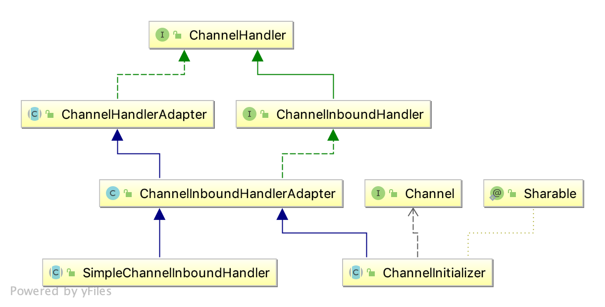

# Netty 学习
## 概述
[官网](https://netty.io)

Netty 是一个异步事件驱动的网络应用框架，用于快速开发高性能基于协议的客户端、服务端。 
### 特点
#### 设计
1. 不同传输类型如阻塞、非阻塞`socket`, 使用统一的API
2. 灵活的、可扩展的事件模型, 开发者只需关注事件的回调
3. 高可自定制的线程模型-单线程、多线程池如**`SEDA`** - **`Staged event driven architechure`**, 事件的不同阶段可采用不同的线程去处理
4. 支持无连接的数据报`datagram`
#### 性能
1. 高吞吐、低延迟 **Better throughput**, **lower latency**
2. 最少资源消耗
3. 最少不必要的内存拷贝

#### 支持的协议
1. `HTPP & WebSocket`
2. `SSL StartTLS`
3. `Google Protobuf`, 序列化结构化的数据，跨语言(Java、Python、C++)、跨平台
4. `zlib/gzip compression` 压缩
5. `Large File Transfer` 大文件传输
6. `RTSP` - `Real Time Streaming Protocol`网络流媒体协议

## 组件

```java
public class HttpServerBootstrap {

    public static void main(String[] args) throws InterruptedException {
        NioEventLoopGroup boss = new NioEventLoopGroup();
        NioEventLoopGroup worker = new NioEventLoopGroup();
        try {
            ServerBootstrap serverBootstrap = new ServerBootstrap();
            serverBootstrap.group(boss, worker).channel(NioServerSocketChannel.class)
                    .handler(new BossChannelHandler())
                    .childHandler(new WorkerChannelInitializer());
            ChannelFuture channelFuture = serverBootstrap.bind(8080).sync();
            channelFuture.channel().closeFuture().sync();
        } finally {
            boss.shutdownGracefully();
            worker.shutdownGracefully();
        }
    }
}
```
1. NioEventLoopGroup Nio事件轮询组, 一般定义两个boss, worker, boss用来接收新的请求，交给worker去处理具体的请求
2. ServerBootstrap 服务端启动
3. ChannelHandler 通道处理器

### 通道处理器
基础的几个通道处理器UML图, 如下:


**ChannelHandler**
```java
package io.netty.channel;

public interface ChannelHandler {

    // 通道处理器被添加时，调用该方法，准备处理事件
    void handlerAdded(ChannelHandlerContext ctx) throws Exception;

    // 通道处理器被移除时，调用该方法，不再处理事件
    void handlerRemoved(ChannelHandlerContext ctx) throws Exception;
}
```

**ChannelHandlerAdapter**  
实现了`ChannelHandler`接口, 但操作为空，允许子类重写
```java
package io.netty.channel;

public abstract class ChannelHandlerAdapter implements ChannelHandler {
 
    @Override
    public void handlerAdded(ChannelHandlerContext ctx) throws Exception {
        // NOOP
    }
    
    @Override
    public void handlerRemoved(ChannelHandlerContext ctx) throws Exception {
        // NOOP
    }
}
```

**ChannelInboundHandler**  
定义了通道相关的回调方法**注册、打开、读取消息、关闭、取消(通道生命周期结束)** 
```java
package io.netty.channel;

public interface ChannelInboundHandler extends ChannelHandler {

    // 通道注册, 绑定到EventLoop
    void channelRegistered(ChannelHandlerContext ctx) throws Exception;
    
    // 取消通道注册，取消在EventLoop中的绑定
    void channelUnregistered(ChannelHandlerContext ctx) throws Exception;

    // 通道打开，等待连接
    void channelActive(ChannelHandlerContext ctx) throws Exception;

    // 通道关闭，通道的生命周期结束
    void channelInactive(ChannelHandlerContext ctx) throws Exception;

    // 通道读取消息
    void channelRead(ChannelHandlerContext ctx, Object msg) throws Exception;

    // 通道读取消息完成
    void channelReadComplete(ChannelHandlerContext ctx) throws Exception;
}
```

**ChannelInboundHandlerAdapter**  
实现了ChannelInboundHandler中的所有方法，实现方式仅仅是将操作传递给下一个`ChannelPipeline`中的`ChannelHandler`，即回调下一个`ChannelHandler`的方法
```java
package io.netty.channel;

public class ChannelInboundHandlerAdapter extends ChannelHandlerAdapter implements ChannelInboundHandler {

    // provide implementations of all ChannelInboundHandler's methods
}
```

**SimpleChannelInboundHandler**  
抽象范型类，重点关注`channelRead`通道读取，范型`I`即为要读取的消息类型，如果类型匹配，则调用子类定义的回调方法`channelRead0`(消息接收)进行读取
```java
package io.netty.channel;

public abstract class SimpleChannelInboundHandler<I> extends ChannelInboundHandlerAdapter {
        
    private final TypeParameterMatcher matcher;
    private final boolean autoRelease;

    protected SimpleChannelInboundHandler() {
        this(true);
    }

    protected SimpleChannelInboundHandler(boolean autoRelease) {
        matcher = TypeParameterMatcher.find(this, SimpleChannelInboundHandler.class, "I");
        this.autoRelease = autoRelease;
    }
    
    // ...
    
    public boolean acceptInboundMessage(Object msg) throws Exception { 
        return matcher.match(msg);
    }
    
    @Override
    public void channelRead(ChannelHandlerContext ctx, Object msg) throws Exception {
        boolean release = true;
        try {
            if (acceptInboundMessage(msg)) {
                @SuppressWarnings("unchecked")
                I imsg = (I) msg;
                channelRead0(ctx, imsg);
            } else {
                release = false;
                ctx.fireChannelRead(msg);
            }
        } finally {
            if (autoRelease && release) {
                ReferenceCountUtil.release(msg);
            }
        }
    }
}
```
**ChannelInitializer**  
正常情况下，在通道处理器被添加到ChannelPipeline后，进行通道的初始化，并且通道初始化后，通道处理器会被从ChannelPipeline中删除(即回调`handlerRemoved`)
```java
package io.netty.channel;

public abstract class ChannelInitializer<C extends Channel> extends ChannelInboundHandlerAdapter {
    
    private final Set<ChannelHandlerContext> initMap = Collections.newSetFromMap(
            new ConcurrentHashMap<ChannelHandlerContext, Boolean>());

    // 通道注册时，调用该方法，之后该实例会被从channel的ChannelPipeline中移除
    protected abstract void initChannel(C ch) throws Exception;

    @Override
    public final void channelRegistered(ChannelHandlerContext ctx) throws Exception {
        // Normally this method will never be called as handlerAdded(...) should call initChannel(...) and remove
        // the handler.
        if (initChannel(ctx)) {
            // we called initChannel(...) so we need to call now pipeline.fireChannelRegistered() to ensure we not
            // miss an event.
            ctx.pipeline().fireChannelRegistered();

            // We are done with init the Channel, removing all the state for the Channel now.
            removeState(ctx);
        } else {
            // Called initChannel(...) before which is the expected behavior, so just forward the event.
            ctx.fireChannelRegistered();
        }
    }

    @Override
    public void handlerAdded(ChannelHandlerContext ctx) throws Exception {
        if (ctx.channel().isRegistered()) {
            // This should always be true with our current DefaultChannelPipeline implementation.
            // The good thing about calling initChannel(...) in handlerAdded(...) is that there will be no ordering
            // surprises if a ChannelInitializer will add another ChannelInitializer. This is as all handlers
            // will be added in the expected order.
            if (initChannel(ctx)) {

                // We are done with init the Channel, removing the initializer now.
                removeState(ctx);
            }
        }
    }

    @Override
    public void handlerRemoved(ChannelHandlerContext ctx) throws Exception {
        initMap.remove(ctx);
    }

    private boolean initChannel(ChannelHandlerContext ctx) throws Exception {
        if (initMap.add(ctx)) { // Guard against re-entrance.
            try {
                initChannel((C) ctx.channel());
            } catch (Throwable cause) {
                // Explicitly call exceptionCaught(...) as we removed the handler before calling initChannel(...).
                // We do so to prevent multiple calls to initChannel(...).
                exceptionCaught(ctx, cause);
            } finally {
                ChannelPipeline pipeline = ctx.pipeline();
                if (pipeline.context(this) != null) {
                    pipeline.remove(this);
                }
            }
            return true;
        }
        return false;
    }
}
```